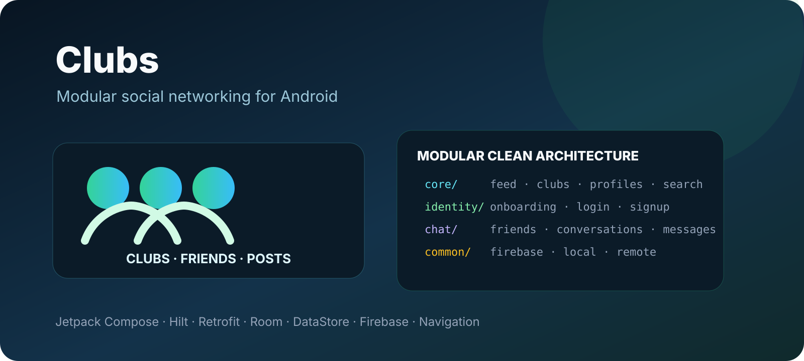

<p align="center"></p>

# Clubs Android Application

A multi-module Android social-networking application centered on clubs, communities, friends, posts, profiles and direct messaging. The project uses Jetpack Compose and separates identity, core social features and chat into independent feature stacks.

> This repository is a fork of [Salmon-family/Clubs](https://github.com/Salmon-family/Clubs). The upstream project history and contributors remain important context for the codebase.

## Features

### Identity
- onboarding and welcome flow
- username/password login
- multi-step sign-up
- email, name, job title, birth date and gender collection
- club selection during onboarding
- account activation flow
- local identity state and remote authentication

### Clubs and social feed
- home feed
- browse and search clubs
- create and edit clubs
- public/private club details
- join/leave clubs
- membership requests and club member management
- posts, comments and reactions
- user profiles and profile editing
- albums and photo detail flows
- friends and friend requests
- saved posts
- notifications
- bug-report screen
- language and theme preferences

### Chat
- recent conversations
- friend list
- one-to-one conversation screen
- sending messages
- local chat cache
- Firebase/FCM integration for messaging notifications

## Architecture

The project is deliberately split into many Gradle modules:

```
app
├── core
│   ├── entities
│   ├── repositories
│   ├── remote
│   ├── local
│   ├── useCases
│   ├── viewModels
│   └── ui
├── identity
│   ├── entities
│   ├── repositories
│   ├── remote
│   ├── local
│   ├── useCases
│   ├── viewModel
│   └── ui
├── chat
│   ├── entities
│   ├── repository
│   ├── remote
│   ├── local
│   ├── firebase
│   ├── useCases
│   ├── viewModels
│   └── ui
└── common
    ├── firebase
    ├── local
    └── remote
```

A typical flow is:

```
Compose UI -> ViewModel -> Use Case -> Repository -> Remote/Local/Firebase source
```

## Tech stack

| Area | Technology |
| --- | --- |
| Language | Kotlin |
| UI | Jetpack Compose |
| Architecture | Clean Architecture + MVVM |
| DI | Hilt |
| Networking | Retrofit + OkHttp |
| Persistence | Room |
| Preferences | DataStore |
| Images | Coil |
| Navigation | Navigation Compose |
| Async | Coroutines + Flow / StateFlow |
| Messaging | Firebase Cloud Messaging |
| Cloud data | Firebase Firestore |
| Monitoring | Firebase Analytics, Crashlytics and Performance |
| CI | GitHub Actions |

The app targets Android API 33 with a minimum SDK of 21.

## Remote API

The core and identity modules communicate with the Clubs backend through Retrofit. The API surface includes user profiles, friends, friend requests, groups/clubs, notifications, albums/photos, posts, comments, likes, search and chat.

The current base URL in the project is:

```
https://club.the-chance.org/api/v1.0/
```

## Local configuration

Create `local.properties` in the project root and provide the API key expected by the remote modules:

```properties
apiKey="YOUR_API_KEY"
```

Firebase services also require the normal Firebase Android project configuration for the application.

Do not commit private API keys or Firebase credentials.

## Build

Requirements:

- Android Studio
- JDK 11
- Android SDK 33

Then build with:

```bash
./gradlew assembleDebug
```

Run unit tests with:

```bash
./gradlew test
```

## Continuous integration

The included GitHub Actions workflow builds the debug application and runs unit tests for pull requests targeting the main development branches.

## Repository note

This fork does not contain an explicit license file at its root. Refer to the upstream repository for original project context and licensing information before redistributing or relicensing the code.
